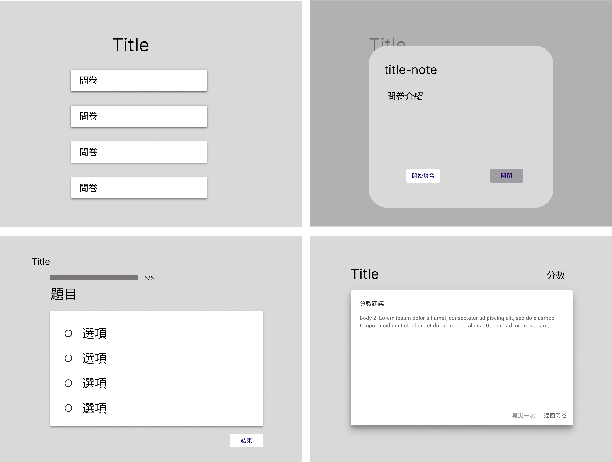

# questionnaire

## 線框搞

初步於Figma 中繪製了四頁的設計稿，展示問卷填寫頁面的初步視覺效果及介面佈局，作為未來開發的參考。




## Customize configuration

See [Vite Configuration Reference](https://vitejs.dev/config/).

## Project Setup

```sh
npm install
```

### Compile and Hot-Reload for Development

```sh
npm run dev
```

### Compile and Minify for Production

```sh
npm run build
```
